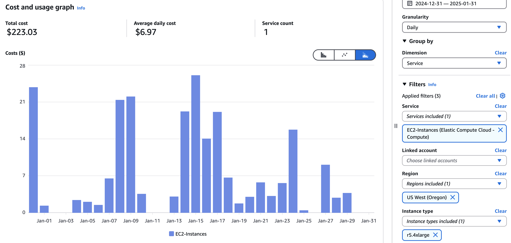

# MUR SST Icechunk Dataset Design Document

## Executive Summary

We created a virtual Icechunk dataset for the MUR SST dataset, enabling efficient cloud-based access while handling inconsistencies in variables, encoding, and chunking.

The workflow now allows fast dataset recreation, detailed in the [Time and cost of writing the virtual dataset](#time-and-cost-of-writing-the-virtual-dataset) section. Performance testing shows time series extraction of 77M points in 36 seconds using Zarr-Python on a VEDA JupyterHub instance.

Future work includes handling post-2023-09-04 chunk shape changes, incremental updates, and batch rechunking to native Zarr.

## Introduction: Goals and Dataset Description

This document describes the structure of the NASA MUR SST dataset and the virtual [Icechunk](https://icechunk.io) dataset created from it. In the future, we plan to create a native Zarr version of this dataset as well, to optimized for time series generation.

### Goals:

- Share workflow for creating an icechunk virtual dataset from the MUR SST dataset.
- Expose and workaround issues in the underlying data files.
- Understand the performance of both writing and reading Icechunk stores.
- Compare virtual store read performance with reading from the original files.

### About the Dataset

Official Name: **GHRSST Level 4 MUR Global Foundation Sea Surface Temperature Analysis (v4.1) at PO.DAAC**

Official NASA Website: http://podaac.jpl.nasa.gov/Multi-scale_Ultra-high_Resolution_MUR-SST

S3 Bucket: `s3://podaac-ops-cumulus-protected/MUR-JPL-L4-GLOB-v4.1`

### Granules

There is one NetCDF4 file produced every day. The dataset begins on June 1, 2002. Through the end of 2024, this amounts to ~8,249 files.

### Internal File Structure

The files are standard NetCDF4 with 4 data variables across all files, and 2 additional variables which show up later in the dataset. Since variables need to be consistent across dimensions, these variables (`dt_1km_data`, `sst_anomaly`) are removed.

The other variables are listed below:

| name             | dtype   | shape             | chunk shape     | num. chunks |
| ---------------- | ------- | ----------------- | --------------- | ----------- |
| time             | int32   | (1,)              | (1,)            | 1           |
| lon              | float32 | (36000,)          | (36000,)        | 1           |
| lat              | float32 | (17999,)          | (17999,)        | 1           |
| analysed_sst     | int32   | (1, 17999, 36000) | (1, 1023, 2047) | 324         |
| analysis_error   | float32 | (1, 17999, 36000) | (1, 1023, 2047) | 324         |
| mask             | float32 | (1, 17999, 36000) | (1, 1447, 2895) | 169         |
| sea_ice_fraction | float32 | (1, 17999, 36000) | (1, 1447, 2895) | 169         |

## Challenges and Solutions

### Inconsistencies in MUR SST Dataset and how we overcome them

The following tables describe the inconsistencies in the dataset, including **extra variables, encoding differences, and chunk shape changes** and how they are addressed.

#### Issues Summary

| **Issue Type**           | **Affected Time Periods**                                          | **Details**                                                                                                                               |
| ------------------------ | ------------------------------------------------------------------ | ----------------------------------------------------------------------------------------------------------------------------------------- |
| **Extra Variables**      | Appears in some files randomly                                     | Variables `dt_1km_data` and `sst_anomaly` are dropped because they are not consistently present across all files.                         |
| **Encoding Differences** | 2003, 2021, and 2022 (specific dates below)                        | Standard encoding: `shuffle (elementsize=2)`, `zlib (level=6)`. Some files deviate from this standard and must be written as native Zarr. |
| **Chunk Shape Changes**  | Various periods starting in 2023 (specific dates below) to present | Different chunk shapes appear in some files                                                                                               |

Exact encoding differences are detailed in [notebooks/mur-sst/write_virtual-2002-2023.ipynb](../notebooks/mur-sst/write_virtual-2002-2023.ipynb).

---

#### Chunk Shape Comparison

| **Variable**                      | **Original Chunk Shape** | **Changed Chunk Shape (Affected Periods)**                                       |
| --------------------------------- | ------------------------ | -------------------------------------------------------------------------------- |
| `analysed_sst` & `analysis_error` | (1, 1023, 2047)          | (1, 3600, 7200) (2023-02-24 to 2023-02-28, 2023-04-22, 2023-09-04 to 2024-03-23) |
| `sea_ice_fraction` & `mask`       | (1, 1447, 2895)          | (1, 4500, 9000) (2023-02-24 to 2023-02-28, 2023-04-22, 2023-09-04 to 2024-03-23) |
| `sea_ice_fraction` & `mask`       | (1, 1447, 2895)          | (1, 1023, 2047) (2024-03-24 to present)                                          |

---

It is yet to be determined how we will handle the chunk shape changes after 2023-09-04.

#### How these issues are addressed

| **Time Period**          | **Reason for Issue**           | **Resolution**                             |
| ------------------------ | ------------------------------ | ------------------------------------------ |
| 2021-02-20 to 2021-02-21 | Encoding differs from standard | Written as native Zarr                     |
| 2021-12-24 to 2021-12-31 | Encoding differs from standard | Written as native Zarr                     |
| 2022-01-01 to 2022-01-26 | Encoding differs from standard | Written as native Zarr                     |
| 2022-11-09               | Encoding differs from standard | Written as native Zarr                     |
| 2023-02-24 to 2023-02-28 | Chunk shape change             | Written as native Zarr                     |
| 2023-04-22               | Chunk shape change             | Written as native Zarr                     |
| 2023-09-04 to 2024-03-23 | Chunk shape change             | TBD (potentially separate virtual dataset) |
| 2024-03-24 to present    | Chunk shape change             | TBD (potentially separate virtual dataset) |

---

## Implementation Approach

- [x] Establish a [development environment](#development-environment).
- [x] [Complete virtual dataset from 2002-06-02 to 2023-09-03](#writing-the-virtual-dataset).
- [x] Demonstrate how to read and [performance of the virtual dataset](#reading-from-and-performance-of-the-virtual-dataset).
- [x] Report on [time and cost to write virtual dataset](#time-and-cost-of-writing-the-virtual-dataset).

### Development Environment

The notebooks in [notebooks/mur-sst](../notebooks/mur-sst) was executed on the [VEDA JupyterHub](https://hub.openveda.cloud) using a custom image (quay.io/developmentseed/veda-optimized-data-delivery-image:latest) maintained in https://github.com/developmentseed/veda-optimized-data-delivery-image.

> [!NOTE]  
> The latest version of this image uses a custom branch of [VirtualiZarr](https://github.com/developmentseed/veda-optimized-data-delivery-image/blob/main/Dockerfile#L45).

> [!WARNING]
> As icechunk is still in development, it is required that the same version of icechunk is used for writing and reading the virtual dataset. The version used for writing this dataset was `0.1.0-alpha12`.

### Writing the virtual dataset

See [notebooks/mur-sst/write_virtual-2002-2023.ipynb](../notebooks/mur-sst/write_virtual-2002-2023.ipynb). Year by year, it uses dask to parallelize generation of virtual datasets, writes those datasets to the icechunk store and then uses dask to validate the data by generating a mean over a year for a specific location from the Icechunk store and then doing the same using the original files.

Note we plan to investigate different parallelization approaches in the future, with an eye for ones that are better suited for running outside of the Jupyter Hub environment. This will reduce the need to babysit and facilitate scaling and monitoring for even faster regeneration and trouble-shooting.

### Time and cost of writing the virtual dataset

The maximum development time and cost is estimated using the AWS Cost Explorer. The estimated development cost was at most $223, based on an r5.4xlarge instance usage during the period of development. However, since user-specific costs aren't tracked, the actual cost is likely lower. The developer estimates spending 50 hours, which translates to approximately $50. This time includes finding and addressing issues with the data.

Now that the workflow is established, recreating the dataset is significantly cheaper:

- Generating virtual data: ~1 minute per year
- Writing Zarr data: ~2 minutes per day (for 43 days)

Total time to recreate the dataset: (21×1)+(43×2)=107 minutes≈$1.80

Validation adds additional costs, requiring 4 minutes per year (~126 minutes total), which would cost around $2.12.

### Reading from and performance of the virtual dataset

In [../notebooks/mur-sst/read_virtual.ipynb](../notebooks/mur-sst/read_virtual.ipynb), we demonstrate generating a 21 year time series of 1 square degree area in 36 seconds, using zarr-python. This equates to fetching 77,660,000 points!

Note, this test was run in us-west-2 using a VEDA JupyterHub instance with 60GB of memory and 15.7 vCPUs, and used a zarr-python runtime configuration for optimizing concurrency.

## Future work

- [ ] Once a stable version of icechunk is released, regenerate and validate the dataset. Move to a public bucket and test with Earthdata credentials.
- [ ] Determine how to handle creating a virtual dataset from 2023-09-04 to present day.
- [ ] Incremental appending to the most recent virtual Icechunk dataset.
- [ ] Batch rechunking from virtual to native Zarr, stored in Icechunk.

### Complete virtual dataset from 2023-09-04 to present day.

A current limitation of the Zarr specification and its implementations is array data must all have the same chunk shape, dimensions, and encodings. Ideally, the Zarr developer community would like to implement a variable array encoding solution in Zarr. This would allow arrays with different compression algorithms and chunk shapes to be accessed as a single array. See [Zarr extension for stacked / concatenated virtual views #288](https://github.com/zarr-developers/zarr-specs/issues/288) to learn more.

In lieu of a solution for concatenating arrays with different encodings and chunk shapes, there are two options:

1. Create 3 virtual Zarr stores: the one created here plus two more, one for the period 2023-09-04 to 2024-03-23, and then 2024-03-23 to date.
   - Pros: Less storage and computation time required to create the datasets.
   - Cons: More complicated user experience to manage three datasets for a complete time series.
2. Write 2023-09-04 to 2024-03-23 as native Zarr to the existing store and then write 2024-03-24 to date as a new virtual dataset.
   - Pros: More straightforward user experience to manage the dataset.
   - Cons: Longer processing time and more storage required.

### Incremental appending to virtual Icechunk dataset

TBD

### Batch rechunking from virtual to native Zarr, stored in Icechunk

TBD
